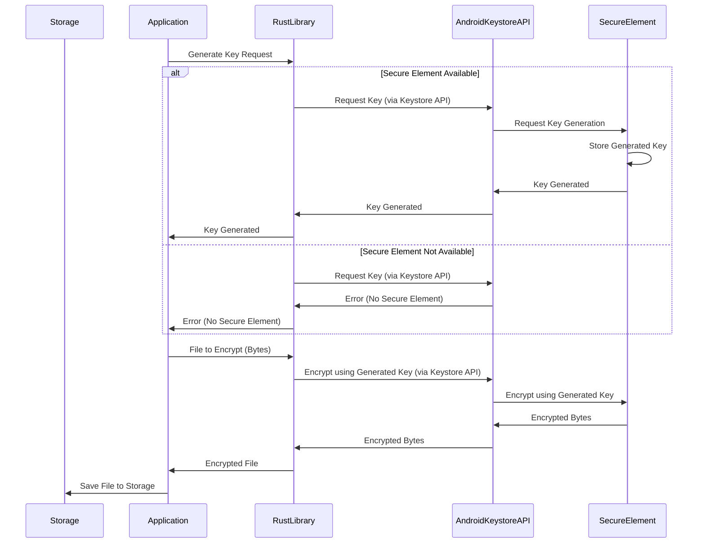

# Architecture

# Prototype Overview

The prototype is a Java application designed to test and demonstrate the functionality of interacting with the Android implementation of the Crypto-Abstraction-Layer. This layer provides a unified interface for cryptographic operations, abstracting the underlying complexities of different cryptographic algorithms and hardware implementations.

# Prototype Functionality

1. Key Generation: The creation of cryptographic keys for various algorithms.
2. Symmetric and Asymmetric Encryption of Text and Images: Encrypting data using both symmetric (e.g., AES) and asymmetric (e.g., RSA) algorithms.
3. Symmetric and Asymmetric Decryption of Text and Images: Decrypting data that was encrypted using symmetric and asymmetric algorithms.
4. Signing Encrypted Bytes: Generating digital signatures for encrypted data to ensure authenticity and integrity.
5. Verification of Signatures: Verifying the authenticity of digital signatures to confirm the integrity of the data.

# Prototype UI

# Key Generation Process

1. The user specifies the algorithm, padding, and purposes for the key.
2. The user clicks a button to generate the key.
3. The Java application sends this instruction to the library.
4. The library requests the Keystore to generate a key on the device's Secure Element.

# Encryption Process

1. After the key is generated, the user selects a file to encrypt.
2. The Java application sends the file bytes to the library.
3. The library uses the generated key to encrypt the data.
4. The library sends the encrypted bytes back to the Java application.

Decryption, signing, and verification follow a similar process to encryption.
