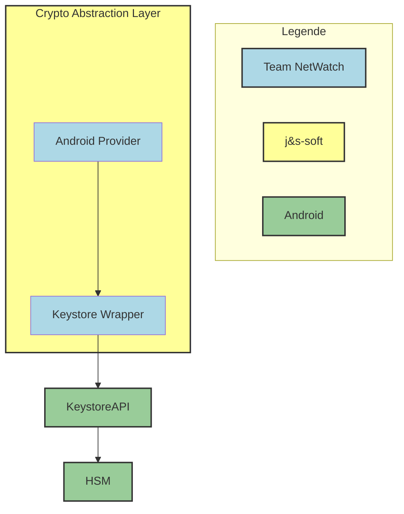

# Architecture

## Crypto Abstraction Layer
The Crypto Abstraction Layer is being developed by j&s-soft GmbH and invokes methods from the Android Providers.
## Android Provider
The Android Provider furnishes the necessary functionalities required by the Crypto Abstraction Layer. Within the Android Provider, data is formatted in a way that the Keystore API can handle, and conversely, data returned by the Keystore API is reformatted for the Crypto Abstraction Layer.
## Keystore Wrapper
The Keystore Wrapper receives essential data and parameters from the Android Provider, which it then forwards to the Keystore API.
## Keystore API
The Keystore API enables communication with the HSM.
## HSM
The HSM is the hardware responsible for performing cryptographic procedures and securely storing the key.
